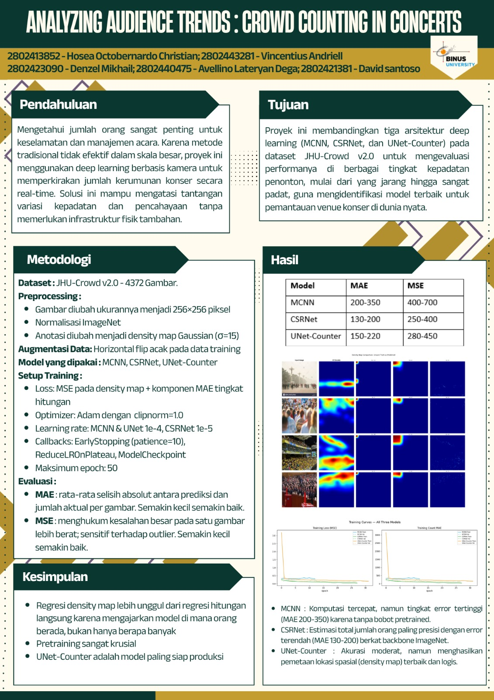

# Crowd Counting with CNN

Eksperimen crowd counting berbasis density map pada dataset JHU-Crowd v2.0. Notebook membandingkan implementasi MCNN, CSRNet, dan UNet-Counter menggunakan TensorFlow/Keras, dari eksplorasi data sampai evaluasi dan visualisasi.

## Project overview

Alih-alih memprediksi satu angka secara langsung, model menghasilkan density map. Jumlah nilai pada map digunakan untuk mengestimasi banyaknya orang dalam gambar.

Pipeline mencakup:

1. Membaca gambar dan anotasi titik kepala.
2. Exploratory data analysis dan visualisasi distribusi jumlah orang.
3. Resize gambar menjadi 256 × 256 dan normalisasi kanal.
4. Membentuk density map dengan Gaussian smoothing (`sigma=15`).
5. Training tiga model, evaluasi count error, dan perbandingan visual.

## Models

| Model | Implementasi dalam notebook |
| --- | --- |
| MCNN | Tiga cabang CNN dengan ukuran kernel berbeda |
| CSRNet | VGG16 pretrained ImageNet, dilated convolutions, dan upsampling |
| UNet-Counter | Encoder–decoder dengan skip connections |

Training memakai custom loss yang menggabungkan pixel MSE dan count loss, Adam dengan gradient clipping, early stopping, pengurangan learning rate, dan model checkpoint.

## Recorded results

Angka berikut berasal dari output evaluasi test set yang tersimpan di notebook repository; bukan hasil rerun pada environment baru.

| Model | MAE | RMSE |
| --- | ---: | ---: |
| MCNN | 248.64 | 644.98 |
| CSRNet | 137.99 | 456.50 |
| UNet-Counter | 172.59 | 537.15 |

CSRNet memiliki MAE terendah pada run tersebut. Notebook menamai kolom kedua `MSE`, tetapi kode menghitung akar rata-rata kuadrat error, sehingga di sini ditulis **RMSE**. Nilai yang lebih kecil berarti count error lebih rendah. Hasil ini berlaku untuk konfigurasi eksperimen dalam notebook, bukan klaim benchmark universal.

## Project files

- [kelompok4-deeplearning-crowdcounting.ipynb](kelompok4-deeplearning-crowdcounting.ipynb): kode, penjelasan, grafik, dan output eksperimen.
- [CrowdCounting_Poster.jpeg](CrowdCounting_Poster.jpeg): poster proyek.

## Poster



## Getting started

Notebook menggunakan path Kaggle `/kaggle/working/`. Cara menjalankan yang paling sesuai dengan kode saat ini adalah membuka notebook dalam environment Kaggle dengan GPU dan akses internet.

1. Upload atau impor notebook ke Kaggle.
2. Pastikan TensorFlow/Keras, NumPy, Pandas, Matplotlib, OpenCV, SciPy, tqdm, dan `gdown` tersedia.
3. Cell download memanggil executable `gdown`. Jika belum tersedia, jalankan `%pip install gdown` pada cell setup.
4. Periksa akses dataset pada cell download. Alternatifnya, siapkan dataset sendiri dan sesuaikan `DATA_ROOT`.
5. Jalankan cell secara berurutan. Notebook mengonfigurasi training hingga 50 epoch per model dengan early stopping.

Struktur dataset yang diharapkan:

```text
jhu_crowd_v2.0/
├── train/
│   ├── images/*.jpg
│   └── gt/*.txt
├── val/
│   ├── images/*.jpg
│   └── gt/*.txt
└── test/
    ├── images/*.jpg
    └── gt/*.txt
```

Pada Jupyter lokal atau Colab, sesuaikan path download, extraction, dataset, dan checkpoint yang masih memakai `/kaggle/working/`. Checkpoint ditulis sebagai `{model_name}_best.keras` di folder tersebut.

## Scope & limitations

- Dataset dan checkpoint model tidak disertakan di repository.
- Versi dependensi tidak dikunci melalui requirements file.
- Training membutuhkan waktu dan memori yang cukup; cache dataset, batch size 8, dan penggunaan GPU perlu disesuaikan dengan environment.
- Resize 256 × 256 dan Gaussian sigma tetap dapat menghilangkan detail pada kerumunan padat.
- Tidak ada inference API atau aplikasi web yang disertakan; isi repository adalah notebook eksperimen dan poster.
- Tabel perkiraan pada bagian kesimpulan notebook berbeda dari output run tersimpan; tabel README menggunakan output evaluasi aktual.

## Links

[GitHub / hoseaoc](https://github.com/hoseaoc) · [Portfolio](https://hosea-christian-portfolio.vercel.app)
